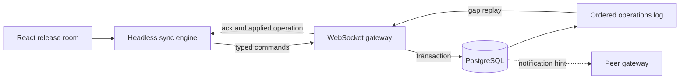

# Realtime Collaboration Lab

[](https://github.com/wasiliy-strecker/realtime-collaboration-lab/actions/workflows/ci.yml)

[](LICENSE)

A production-minded React and Node.js reference for collaborative interfaces
that must converge when users write concurrently, connections disappear, or a
gateway restarts.

The demonstration domain is a shared release room. Multiple operators plan and
move release cards while a headless sync engine keeps confirmed state,
optimistic intent, reconnect replay, and ephemeral presence separate.

## Why this repository exists

Most realtime demos broadcast an object and assume every client receives every
message. This project instead makes ordering, idempotency, recovery, slow
consumers, and honest consistency guarantees part of the design.

The implementation is delivered in independently verified slices. The
foundation and framework-independent collaboration core are in place; the
gateway and React application remain separate later slices.

## Implemented core

- strict Zod contracts for boards, commands, canonical events, and every wire message
- server sequence and replay-range validation at the runtime boundary
- immutable release-board transitions with explicit domain errors
- generic optimistic sync engine with injected transport and persistence
- confirmed state plus ordered pending intent as the only optimistic projection source
- reconnect hydration, idempotent duplicate handling, rejection rebase, and gap recovery
- serialized persistence writes so a slower old save cannot replace newer state
- Fastify gateway with origin-checked, cookie-authenticated WebSocket upgrades
- atomic PostgreSQL board snapshots and append-only, gap-free operation sequences
- cross-instance operation hints through transactional `LISTEN/NOTIFY`
- ephemeral presence, heartbeats, command rate limits, and slow-consumer protection
- deterministic unit and property tests with enforced coverage thresholds

Read the [protocol and sync engine contract](docs/protocol-and-sync-engine.md)
for the public interfaces and recovery rules, then the
[gateway and PostgreSQL contract](docs/gateway-and-postgres.md) for server-side
coordination.

## Target architecture



PostgreSQL owns durable board state and server ordering. `LISTEN/NOTIFY` only
wakes gateway instances; clients and gateways recover missed messages
from the durable operations log.

## Planned guarantees

- client-generated operation IDs make command retries idempotent
- each board receives one monotonic server sequence
- optimistic state is always derived from confirmed state plus pending commands
- reconnecting clients resume from their last confirmed sequence
- sequence gaps trigger durable replay instead of speculative repair
- presence remains ephemeral and is never presented as durable state
- the project does not claim CRDT or exactly-once network delivery

See the [architecture notes](docs/architecture.md) for ownership and failure
boundaries.

## Foundation setup

Requirements are Node.js 22.12 or newer and pnpm 11.

```bash
corepack enable
pnpm install --frozen-lockfile
pnpm verify
```

Start PostgreSQL and the gateway:

```bash
cp .env.example .env
docker compose up -d postgres
pnpm dev:gateway
```

The gateway listens on `http://127.0.0.1:3001`. `POST /api/demo-sessions`
creates a signed HTTP-only demo session, `GET /api/boards/{boardId}` exposes the
confirmed snapshot, and `/ws` carries the ordered collaboration protocol.

## Repository layout

```text
apps/gateway/        Fastify, WebSocket, PostgreSQL, and presence coordination
apps/web/            React release room in a later slice
packages/protocol/   Runtime schemas and release-board transitions
packages/sync-engine Framework-independent optimistic state and recovery
docs/                Architecture, guarantees, and verification evidence
```

## License

Copyright 2026 Wasiliy Strecker. Licensed under the [MIT License](LICENSE).
