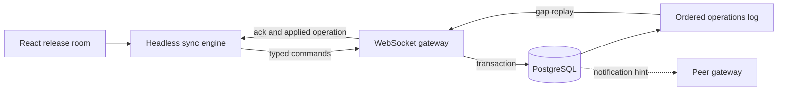

# Realtime Collaboration Lab

[](https://github.com/wasiliy-strecker/realtime-collaboration-lab/actions/workflows/ci.yml)

[](LICENSE)

A production-minded React and Node.js reference for collaborative interfaces
that must converge when users write concurrently, connections disappear, or a
gateway restarts.

The demonstration domain is a shared release room. Multiple operators plan and
move release cards while a headless sync engine keeps confirmed state,
optimistic intent, reconnect replay, and ephemeral presence separate.

## Why this repository exists

Most realtime demos broadcast an object and assume every client receives every
message. This project instead makes ordering, idempotency, recovery, slow
consumers, and honest consistency guarantees part of the design.

The implementation is delivered in independently verified slices. The
framework-independent core, durable gateway, reusable React binding, and
optimistic release-room application are now integrated without collapsing
their ownership boundaries.

## Implemented core

- strict Zod contracts for boards, commands, canonical events, and every wire message
- server sequence and replay-range validation at the runtime boundary
- immutable release-board transitions with explicit domain errors
- generic optimistic sync engine with injected transport and persistence
- confirmed state plus ordered pending intent as the only optimistic projection source
- reconnect hydration, idempotent duplicate handling, rejection rebase, and gap recovery
- serialized persistence writes so a slower old save cannot replace newer state
- Fastify gateway with origin-checked, cookie-authenticated WebSocket upgrades
- atomic PostgreSQL board snapshots and append-only, gap-free operation sequences
- cross-instance operation hints through transactional `LISTEN/NOTIFY`
- ephemeral presence, heartbeats, command rate limits, and slow-consumer protection
- a tear-free `useSyncEngine` React binding built on `useSyncExternalStore`
- a runtime-validated browser transport with ping/pong, replay, and explicit rejection handling
- validated local persistence for confirmed state and queued offline intent
- bounded reconnect with jitter, online recovery, and per-tab client identity
- an accessible release board with optimistic editing, assignment, readiness, and drag-and-drop
- Prometheus metrics, structured collaboration events, and database-backed readiness
- deterministic unit and property tests with enforced coverage thresholds
- Chromium failure scenarios against the real gateway and PostgreSQL operation log

Read the [protocol and sync engine contract](docs/protocol-and-sync-engine.md)
for the public interfaces and recovery rules, then the
[gateway and PostgreSQL contract](docs/gateway-and-postgres.md) for server-side
coordination, and the [React client contract](docs/react-client.md) for browser
state, transport, and accessibility boundaries. The
[reliability evidence](docs/reliability-evidence.md) maps browser failures to
the recovery behavior exercised in CI. The [observability contract](docs/observability.md)
defines metric labels, structured events, readiness, and operational queries.

## Target architecture



PostgreSQL owns durable board state and server ordering. `LISTEN/NOTIFY` only
wakes gateway instances; clients and gateways recover missed messages
from the durable operations log.

## Implemented guarantees

- client-generated operation IDs make command retries idempotent
- each board receives one monotonic server sequence
- optimistic state is always derived from confirmed state plus pending commands
- reconnecting clients resume from their last confirmed sequence
- sequence gaps trigger durable replay instead of speculative repair
- presence remains ephemeral and is never presented as durable state
- the project does not claim CRDT or exactly-once network delivery

See the [architecture notes](docs/architecture.md) for ownership and failure
boundaries.

## Foundation setup

Requirements are Node.js 22.12 or newer and pnpm 11.

```bash
corepack enable
pnpm install --frozen-lockfile
pnpm verify
```

With PostgreSQL running locally, install Chromium once and execute the browser
failure scenarios:

```bash
pnpm exec playwright install chromium
pnpm test:e2e
```

Start PostgreSQL, the gateway, and the React application:

```bash
cp .env.example .env
docker compose up -d postgres
pnpm dev:gateway
```

In a second terminal:

```bash
pnpm dev:web
```

Open `http://127.0.0.1:5173`. Vite proxies API and WebSocket traffic to the
gateway on `http://127.0.0.1:3001`. `POST /api/demo-sessions` creates a signed
HTTP-only demo session, `GET /api/demo-session` restores its public identity,
and `/ws` carries the ordered collaboration protocol.

The gateway exposes liveness at `/api/health`, PostgreSQL-backed readiness at
`/api/ready`, and Prometheus text exposition at `/metrics`:

```bash
curl http://127.0.0.1:3001/api/ready
curl http://127.0.0.1:3001/metrics
```

## Repository layout

```text
apps/gateway/        Fastify, WebSocket, PostgreSQL, and presence coordination
apps/web/            React release room, browser transport, persistence, and reconnect
e2e/                 Real-browser concurrency, outage, and replay-gap scenarios
packages/protocol/   Runtime schemas and release-board transitions
packages/react-sync/ Tear-free React adapter for the headless sync engine
packages/sync-engine Framework-independent optimistic state and recovery
docs/                Architecture, guarantees, and verification evidence
```

## License

Copyright 2026 Wasiliy Strecker. Licensed under the [MIT License](LICENSE).
