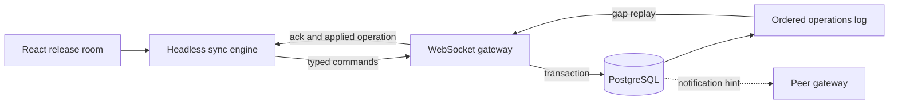

# Realtime Collaboration Lab

[](https://github.com/wasiliy-strecker/realtime-collaboration-lab/actions/workflows/ci.yml)

[](LICENSE)

A production-minded React and Node.js reference for collaborative interfaces
that must converge when users write concurrently, connections disappear, or a
gateway restarts.

The demonstration domain is a shared release room. Multiple operators plan and
move release cards while a headless sync engine keeps confirmed state,
optimistic intent, reconnect replay, and ephemeral presence separate.

## Why this repository exists

Most realtime demos broadcast an object and assume every client receives every
message. This project instead makes ordering, idempotency, recovery, slow
consumers, and honest consistency guarantees part of the design.

The implementation is delivered in independently verified slices. The initial
foundation establishes the quality gates and architectural boundaries before
the protocol, gateway, and React application are introduced.

## Target architecture



PostgreSQL will own durable board state and server ordering. `LISTEN/NOTIFY`
will only wake gateway instances; clients and gateways recover missed messages
from the durable operations log.

## Planned guarantees

- client-generated operation IDs make command retries idempotent
- each board receives one monotonic server sequence
- optimistic state is always derived from confirmed state plus pending commands
- reconnecting clients resume from their last confirmed sequence
- sequence gaps trigger durable replay instead of speculative repair
- presence remains ephemeral and is never presented as durable state
- the project does not claim CRDT or exactly-once network delivery

See the [architecture notes](docs/architecture.md) for ownership and failure
boundaries.

## Foundation setup

Requirements are Node.js 22.12 or newer and pnpm 11.

```bash
corepack enable
pnpm install --frozen-lockfile
pnpm verify
```

Start the local PostgreSQL dependency when a later integration slice requires
it:

```bash
cp .env.example .env
docker compose up -d postgres
```

## Repository layout

```text
apps/       Fastify gateway and React release room in later slices
packages/   Runtime protocol and framework-independent sync engine
docs/       Architecture, guarantees, and verification evidence
```

## License

Copyright 2026 Wasiliy Strecker. Licensed under the [MIT License](LICENSE).
